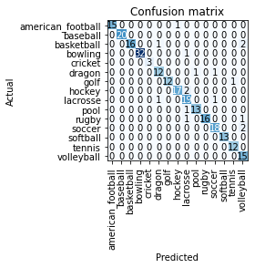

# [Project 1: Salary Estimator](https://github.com/arizkyrahman/ds_salary_project)
- Created a tool that estimates salaries (MAE ~ $ 11K) to help them negotiate their income when they get a job.
- Scraped over 1000 job descriptions from glassdoor using python and selenium
- Engineered features from the text of each job description to quantify the value companies put on python, excel, aws, and spark.
- Optimized Linear, Lasso, and Random Forest Regressors using GridsearchCV to reach the best model.
- Built a client facing API using flask

# [Project 2: Build Data Pipeline](https://www.startdataengineering.com/post/data-engineering-project-for-beginners-batch-edition/)
- Set up Apache Airflow, AWS EMR, AWS Redshift, AWS Spectrum, and AWS S3.
- Spot failure points in data pipelines and build systems resistant to failures.
- Automatic Schema Evolution.
- Design and build a data pipeline from business requirements.

# [Project 3: Ball Image Classifier](https://github.com/arizkyrahman/ball-image-classifier)
I built a ball classifier to identify balls from different sports. This could be useful for someone who is new to sports from a certain country. They could take a picture of a ball and an app could serve them some information about the history and rules of the game. This is the underlying model for building something with those capabilities. 

I was able to get the model to predict the sport of the ball with 94% accuracy after minimal tuning. For most of the cases this would meet the need of an end user of the app. To get these results I used transfer learning on a CNN trained on resnet34. This created time efficiencies and solid results.

